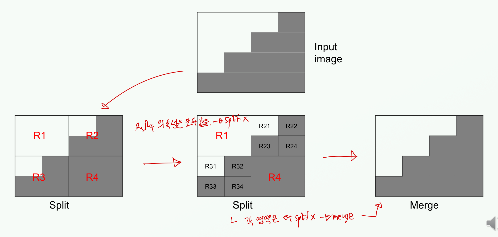

# Artificial Vision of Computers: A Review

$$
\mathbf{\text{Wonjun Park}} \\
\mathrm{\text{Computer Science and Engineering}} \\
\mathrm{\text{Konkuk University}} \\
\mathrm{\text{Seoul, South Korea}} \\
\mathrm{\text{kuwjjgjk at konkuk.ac.kr}}
$$

### *Abstract*

Can computers have their own eyes? CV is a field of AI to make computers recognize the real world. The field has been critical in Computer Science because CV is believed as the key of the existed and unsolved problems in the world such as self-driving. Even though I published the paper regarding a plant image classification with MLOps, I have not yet taken the lecture about CV, feeling that I am lacked to go further. In this paper, I will review the traditional CV methods manually taken by researchers' effort, the methodologies of feature extractions, and deep learning which integrates the previous two parts and the train of classifiers. Since the lecturer is specialized in images, the paper especially tackles techniques regarding images.

$$ \mathbf{Acronym / Abbreviation} \\
\begin{array}{|c|c|}
\hline
\text{Artificial Intelligence (AI)} & \text{Computer Vision (CV)} \\
\hline
\text{Machine Learning Operations (MLOps)} & \text{Convolutional Neural Network (CNN)} \\
\hline
\text{Contrastive Language-Image Pretraining (CLIP)} & \text{State-Of-The-Art (SOTA)} \\
\hline
\text{Large Language Model (LLM)} & \text{Generative Pre-trained Transformer (GPT)} \\
\hline
\text{Artificial General Intelligence (AGI)} & \text{Machine Learning (ML)} \\
\hline
\text{Red Green Blue (RGB)} & \text{Cyan Magneta Yellow (CMY)} \\
\hline
\text{Hue Saturation Intensity (HSI)} & \text{Luminance In-phase Quadrature (YIQ)} \\
\hline
\text{} & \text{} \\
\hline
\text{} & \text{} \\
\hline
\end{array} $$

##### Keywords
* **CMY** (or **CMYK**): The difference is whether the Black (k) is mixed or uses as an additional basic color. Uses for printing. If k is added during printing, a cost decreases.
* **YIQ**: Uses for compression.

## I. Introduction

The ultimate goal of AI is to make human live their lives with safety. With this goal, the concept of AGI was proposed. However, every step is always started with a baby step. Dividing into several areas, AI has been researched so far. CV is an area where has been imitated the system of human eyes to develop eyes of computers. For instance, the human eyes recognize the world with the following order: an outline, a depth sensation, and a color <!--(Detailed steps are needed to check whether they are correct or not)-->. CV replicated these steps during extractions of features. The sensation of CNN is that the steps are conducted automatically.

Traditionally, CV is divided into three parts: preprocessing, feature extraction, and classification. Preprocessing is a step that transforms raw data into a suitable format to train ML models. Image preprocessing has five techniques as the following.

**1) Color**
Color is a fundamental unit of recognizing image information. While humans have a visible spectrum from $400\ \text{nm (blue)}$ to $700 \text{nm (red)}$, machines see further than that (eg. X-rays, infrared, radio waves). Traditionally, researchers defined various color spaces to handle the information of the color in computers. For example, RGB, CMY, HSI, and YIQ are utilized to represent colors. While RGB is additive primary colors, CMY(K) is subtractive primary colors. The subtractive color are called subtractive because pigments in the paint absorb certain wavelengths in the color spectrum [[4]](#mjx-eqn-4).
HSI (or HS series with HSV and HSL) is a projection of the RGB color space onto a cylinder. Hue (H) is a degree from 0 to 360 where red is matched at 0, 120 is green, and blue is 240. Saturation (S) which refers to a radian of the cylinder is a percentage of how the color is contained, 0% is a black and 100% means the full color [[5]](#mjx-eqn-5).

For YIQ, [[4]](#mjx-eqn-4) addressed with its formula at p.96-97 including its section 2.3.2 Color. Additional color spaces were in the section.

When it comes to HSI (H and I are skipped in the paper),

Color histogram represents all values in images. In $x$-axis, the value of pixel (0-255 if in gray scale) is positioned. The histogram is so easily computed and normalized that different qualities of images like HD, 2k, and 4K, are readily compared [[3]](#mjx-eqn-3). Furthermore, the histogram enables to query or classify images based on their color rather than their metadata [[2]](#mjx-eqn-2).
<!--WHAT IS HSI?-->

**2) Contrast Enhancing**

**3) Noise Filtering**

**4) Smoothing**

**5) Norphological Operator**

Previous researchers categorized image features as low, mid, and high level. Color and edge in images are low level features, texture and shape are middle level, and object is referred as a high level feature.

These techniques are useful when tuned hyperparameters in convolutional layers of deep learning.

Image Segmentation is an operation which divides an image into a collection of connected set of pixels that has similar properties or features. Among the methods of Image Segmentation, Region-based Segmentation is specifically addressed in this paper. Region Growing and Split & Merge are traditional methods in Region-based Segmentation. Region growing begins at a specific seed point and seeks to incorporate adjacent pixels into the region, continuing this process until no additional pixels can be added. In order to decide whether the pixel is merged or not, a defined predicate function determines a similarity between these regions so that defining the predicate function is important [[9]](#mjx-eqn-9). Split and Merge follows the algorithm below:

$$
\begin{array}{c}
\text{SPLIT AND MERGE ALGORITHM} \\
\hline
\text{(1) Split region } R_i \text{ into four disjoint coordinates until the regions only have their similar features} \\
\text{(2) When further splitting is impossible, merge adjacent regions which satisfy } Q(R_i \cup R_j) \text{ which means that the regions have similar features.} \\
\text{(3) Stop when further merging is impossible.}
\end{array}
$$

$\text{Fig 1. Split and Merge Example [The Course Materials]}$

However, the Split and Merge technique is barely used for the quality of images and videos recently becomes higher. The technique has a deficiency in cathching details which is caused by its spliting method partitioning into four disjoint coordinates. Clustering makes groups of a set of objects using an unsupervised method. The difference between Region Growing and Clustering is that while Region Growing requires giving initial inputs, Clustering selects random centroids whether the centroids are real pixels in an image or not [[8]](#mjx-eqn-8). K-means Clustering algorithm is one of clustering models which refers as centroid model. Requring users to decide the number of clusters before its starting, K-means algorithm has a benefit that its computational time is short. The algorithm adopted the Least Square error as its loss function which is defined as

$$
D = \sum_{k=1}^K \sum_{x_i \in C_k} ||x_i - m_k||^2 \\
\text{when } C_k \text{ are the number of K clusters with their means } m_k
$$

$$
\begin{array}{c}
\text{K-MEANS CLUSTERING ALGORITHM} \\
\hline
\text{(1) Choose random centroids with the number of K. Whether the centroids is real pixels or not is depended on users.} \\
\text{(2) Make groups for pixels with the distance from the centroids. The pixel is grouped to the minimum distance among the centroids.} \\
\text{(3) Update the centroids with the constructed groups and Calculate the Loss} \\
\text{(4) Repeat (2) and (3) until the loss value is not changed}
\end{array}
$$

Either the centroids of the groups or the real pixel values in the groups becomes their representative colors. Normally, the bigger $K$ images are over-segmented and the smaller $K$ images are under-segmented. For references, Hierarchical Clustering and Agglomerative Clustering are the recent studies for Segmentation.

## II. Literature Reviews

#### A. Superpixel Segmentation

F. Yang [[6]](#mjx-eqn-6) incorporated a superpixel algorithm into CNN. <!-- Summary with codes, https://cran.r-project.org/web/packages/OpenImageR/vignettes/Image_segmentation_superpixels_clustering.html --> D. Stutz [[7]](#mjx-eqn-7) reviewed various superpixel algorithms in 2018.

#### B. CLIP

CLIP is a vision language model. For now, this model showed SOTA performances in retrieval tasks.

LLM has limitations so far <!--WHAT KIND OF LIMTATIONS DO THEY HAVE-->. One of the limitations of the model is that it demonstrated insufficient social reasoning. For example, if someone removes a chair that someone else was about to sit on, GPT translates this situation as the person helping to let the other person sit. For Social reasoning lets human belong the society well, the deficiency can not be overlooked.

#### C. DINO

DINO [[1]](#mjx-eqn-1) was proposed by ()?. and the next-generation CV model? DINO targets to Image Foundation Models?

## III. Challenges

#### A. Classification

#### B. Retrieval

## IV. Implementation

## V. Conclusion

## References

$\tag*{}\label{1} \text{[1] M. Caron et al., "Emerging Properties in Self-Supervised Vision Transformers," 2021 IEEE/CVF International Conference on Computer Vision (ICCV), Montreal, QC, Canada, 2021, pp. 9630-9640, doi: 10.1109/ICCV48922.2021.00951. [IEEE]}$
$\tag*{}\label{2} \text{[2] https://www.pinecone.io/learn/series/image-search/color-histograms/, accessed in Mar. 10 2024 [url]}$
$\tag*{}\label{3} \text{[3] https://courses.cs.washington.edu/courses/cse455/10au/notes/Color.pdf, accessed in Mar. 10 2024 [course materials]}$
$\tag*{}\label{4} \text{[4] Computer Vision: Algorithms and Applications, 2nd ed., available: https://szeliski.org/Book/, [book]}$
$\tag*{}\label{5} \text{[5] https://www.w3schools.com/css/css_colors_hsl.asp, accessed in Mar. 22 2024 [url]}$
$\tag*{}\label{6} \text{[6] F. Yang, Q. Sun, H. Jin and Z. Zhou, "Superpixel Segmentation With Fully Convolutional Networks," 2020 IEEE/CVF Conference on Computer Vision and Pattern Recognition (CVPR), Seattle, WA, USA, 2020, pp. 13961-13970, doi: 10.1109/CVPR42600.2020.01398. [IEEE]}$
$\tag*{}\label{7} \text{[7] Stutz, David, Alexander Hermans, and Bastian Leibe. "Superpixels: An evaluation of the state-of-the-art." Computer Vision and Image Understanding 166 (2018): 1-27. [MLA]}$
$\tag*{}\label{8} \text{[8] https://stackoverflow.com/questions/22016678/region-growing-vs-clustering, accessed in Mar. 23 2024 [discouraged]}$
$\tag*{}\label{9} \text{[9] https://www.sciencedirect.com/topics/mathematics/region-growing, accessed in Mar. 23 2024 [url]}$

